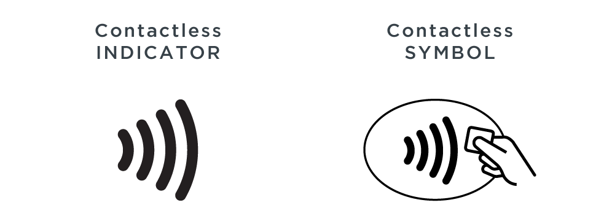

# UX Journal 1 - Gas Station payment eXperience

## Minh Nguyen, 03/07/2021

Ever since the beginning of this course, I've been making side observations of certain technological scenarios throughout some days. 
For instance, this morning I noticed that my car is very low on gas. I had about 15 miles remaining on my gas tank, therefore I had to 
head out to a local gas station. Luckily Costco Gasoline is very cheap compared to many other gas stations, and it is only about 2 miles away
from home. As I parked my car and took the gas pump to fill my gas tank, I noticed something off. 

I noticed that there is a very small panel that includes a symbol that represents NFC. 

Suprisingly, Costco Gasoline now accepts Apple Pay or most debt or credit cards that comes with NFC chip. With this feature being fully functional, I believe it fulfills multiple goals. I found out that this new feature is **useful** because I noticed that many people sometimes leave their cards at home because they forgot. Also, because of COVID-19, we tend to reduce physical contacts, therefore the option of contactless payment is very useful during this time. I also think it is **efficient** because the usability of this feature is so simple, the only way you can misuse it is if you were to accidentally use a payment method that wasn't intended (different card with NFC reader). Another thing is that it is **satisfying** to use contactless payment method because with the traditional way of using a physical card as payment, you will have to interact with an interface that asks you information about the card such as if it is a credit card or a debt card, or it would ask you to for the zip code associated with the card. With contactless payment, your phone or your NFC credit/debt card already contains information that will be inputted into the system, therefore it will require less steps on getting the task done. 
