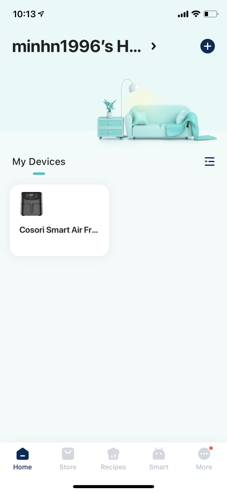

# UX Journal 2 - 

## Minh Nguyen, 04/28/2021
**satisfying**
**useful**
**efficient**
**satisfying**

As I made lunch on a typical weekday, I noticed that I can document my experience with my air fryer. This air fryer has been my most used appliance for the past year, and I've been loving it so far. At first glance you can see litted on/off switch that is a touch button right in the center. You can also see a Wi-Fi symbol on the left side, which means that this air fryer can be connected to the internet router which can be control from phones and computers. As I turn on the air fryer, you can see that there are a lot of more touch buttons that litted up such as presets and also the temperature and the cook time in digital number format. This would be a good example of **efficient**, as some consumers would like to cook their food, but don't know the settings to do so. 

 

Also, if you open and take off the basket from the air fryer while it is on, it will indicate that the air fryer cannot be used by replacing the number values with dashes for temperature and cook time. I think that this feature is a good example of **safety**, as the design tries to prevent anyone from getting hurt while using it. Potential consumers such as kids and seniors that could accidentally press a button after taking out the basket, which would turn on the air fryer which would cause injuries such as skin burn. 

 

Here is the app layout if you were to connect the air fryer to the internet so that you can remotely control and set your air fryer wirelessly. I find that this app feature is such a **satisfying** and **useful** experience for most users. Most consumers would place their air fryer in their kitchen, and when they start cooking they go do something else while they wait. Instead of coming back to the air fryer to check on the progress of cooking, they can simply just use the provided app and track the timer or even modify the timer and temperature if they have to. 
