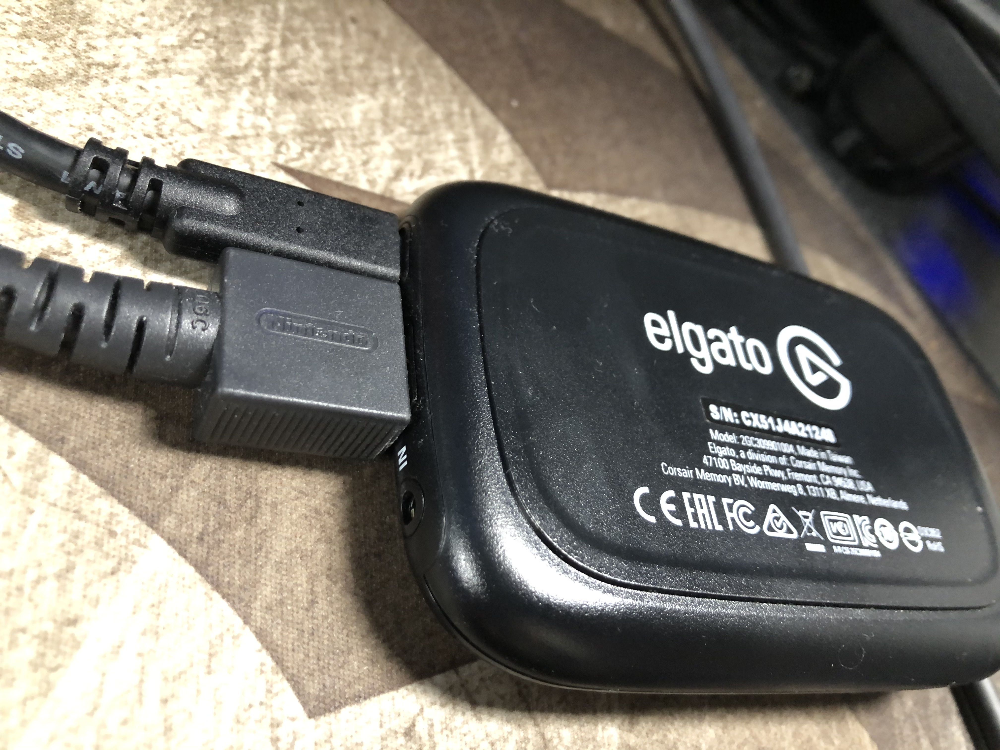
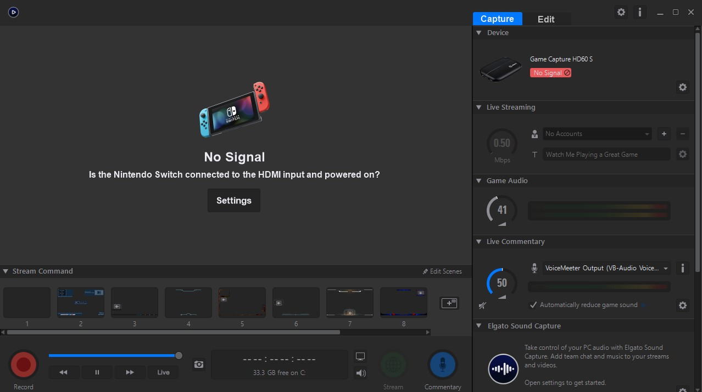
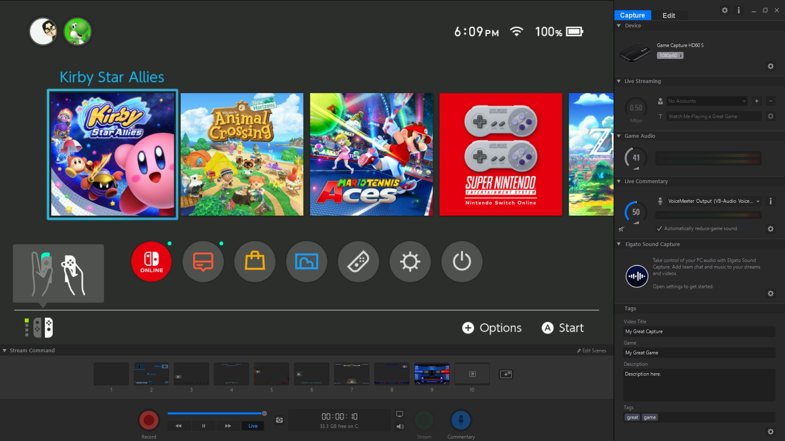
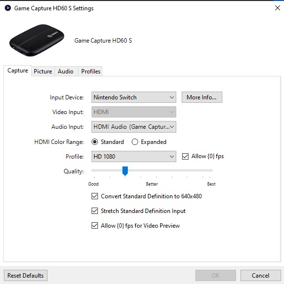

# UX Journal 3- 

## Minh Nguyen, 05/17/2021

For the last journal, I would like to document about my video capture card that I recently got for multiple devices that I own, such as my Nintendo Switch. I use this to output my device into my PC so that I don't have to switch my output on my display every time I want to use it. The connection of the designs consists of the USB connection to the PC which also provides power to the capture card itself, and the HDMI port which connects to the device that I want to output into my PC. In this case as shown below, the HDMI is connected to my Nintendo Switch. 

 

I will now use the application that was provided along with the capture card. Since the initial installation of the software also comes with the driver, it doesn't need any other additional setup in order to get it to work. At first it will show that there's no input connected to the capture card as shown.

 

But once every connection has been made, the application will flawlessly show the signal of the Nintendo Switch. 

 

Now from here, we can adjust the output setting on the right side such as the game audio and other audio settings for the output. At the bottom, there is also an option to record the output that is being captured from the Nintendo Switch. 

 

Here is the app layout if you were to connect the air fryer to the internet so that you can remotely control and set your air fryer wirelessly. I find that this app feature is such a **satisfying** and **useful** experience for most users. Most consumers would place their air fryer in their kitchen, and when they start cooking they go do something else while they wait. Instead of coming back to the air fryer to check on the progress of cooking, they can simply just use the provided app and track the timer or even modify the timer and temperature if they have to. You can also browse through preloaded recipes that is within the app to give you an idea of what to cook in the air fryer.
