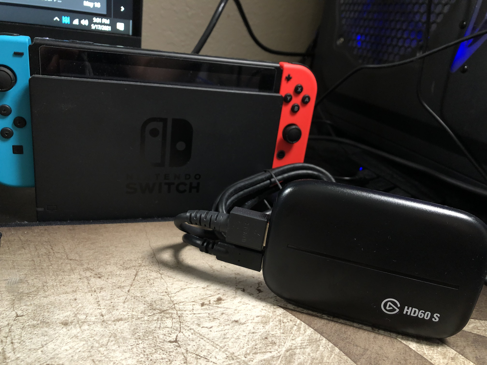

# UX Journal 3- 

## Minh Nguyen, 05/17/2021

I would like to write about my video capture card that I use for multiple devices such as my Nintendo Switch. I use this to output my device into my PC so that I don't have to switch my output on my display every time I want to use it. 

 

Also, if you open and take off the basket from the air fryer while it is on, it will indicate that the air fryer cannot be used by replacing the number values with dashes for temperature and cook time. I think that this feature is a good example of **safety**, as the design tries to prevent anyone from getting hurt while using it. Potential consumers such as kids and seniors that could accidentally press a button after taking out the basket, which would turn on the air fryer which would cause injuries such as skin burn. 

 

Here is the app layout if you were to connect the air fryer to the internet so that you can remotely control and set your air fryer wirelessly. I find that this app feature is such a **satisfying** and **useful** experience for most users. Most consumers would place their air fryer in their kitchen, and when they start cooking they go do something else while they wait. Instead of coming back to the air fryer to check on the progress of cooking, they can simply just use the provided app and track the timer or even modify the timer and temperature if they have to. You can also browse through preloaded recipes that is within the app to give you an idea of what to cook in the air fryer.
